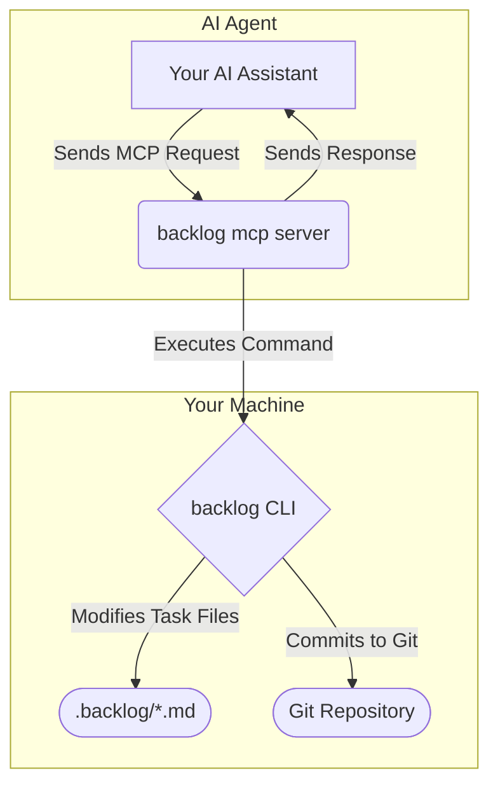

# AI Integration

Backlog includes a Model Context Protocol (MCP) server that exposes task management capabilities to AI agents, making it exceptionally well-suited for AI-assisted development workflows.

## Why AI Integration?

The context window deteriorates rapidly on large-scale projects. A proven workaround is to ask AI agents to "make a plan for X, write it to a markdown file and keep it updated with the ongoing tasks". This technique has worked incredibly well, making refactoring and other significant code changes more resilient to failures, retries, or rate-limiting from the model.

Backlog provides a structured MCP server that AI tools can understand and trust to handle these details, providing a much better experience when using AI tools for complex tasks.

## Starting the MCP Server

### STDIO Transport (Default)

```bash
# Start MCP server using STDIO transport
backlog mcp
```

This is the standard transport method for most AI agents.

### HTTP Transport

```bash
# Start MCP server using HTTP transport
backlog mcp --http --port 8106
```

Use HTTP transport for web-based AI agents or custom integrations.



## Available MCP Tools

The MCP server exposes the following tools to AI agents:

### `task_create`
Create new tasks with full metadata support.

**Parameters:**
- `title` (required): Task title
- `description`: Detailed description
- `priority`: Task priority (low, medium, high)
- `parent`: Parent task ID for hierarchical structure
- `assigned`: List of assignees
- `labels`: List of labels
- `ac`: List of acceptance criteria

**Example usage by AI agent:**
```json
{
  "tool": "task_create",
  "arguments": {
    "title": "Implement user authentication",
    "description": "Add login and registration functionality",
    "priority": "high",
    "assigned": ["alice", "bob"],
    "labels": ["feature", "auth", "backend"],
    "ac": ["Login form validates input", "Registration creates user account", "Password reset works"]
  }
}
```

### `task_list`
List and filter tasks with various criteria.

**Parameters:**
- `status`: Filter by status (todo, in-progress, done)
- `assigned`: Filter by assignee
- `parent`: Filter by parent task ID
- `labels`: Filter by labels
- `unassigned`: Show only unassigned tasks

### `task_view`
Get detailed information about a specific task.

**Parameters:**
- `id` (required): Task ID to view

### `task_edit`
Update existing tasks with field-specific modifications.

**Parameters:**
- `id` (required): Task ID to edit
- `new_status`: Update task status
- `new_title`: Update task title
- `new_description`: Update task description
- `new_priority`: Update task priority
- `add_assigned`: Add assignees
- `remove_assigned`: Remove assignees
- `add_labels`: Add labels
- `remove_labels`: Remove labels
- `check_ac`: Mark acceptance criteria as complete (by index)
- `uncheck_ac`: Mark acceptance criteria as incomplete

### `task_search`
Search tasks by content across titles and descriptions.

**Parameters:**
- `query` (required): Search query string

### `task_archive`
Archive completed tasks (moves them to archived directory).

**Parameters:**
- `id` (required): Task ID to archive

## AI Agent Configuration Examples

### Claude Code (.claude)

```json
{
  "mcpServers": {
    "backlog": {
      "command": "backlog",
      "args": ["mcp"]
    }
  }
}
```

### Gemini (.gemini)

```json
{
  "tools": {
    "backlog": {
      "type": "mcp",
      "command": ["backlog", "mcp"]
    }
  }
}
```

### VSCode (.vscode/settings.json)

```json
{
  "mcp.servers": {
    "backlog": {
      "command": "backlog",
      "args": ["mcp"],
      "env": {}
    }
  }
}
```

## Common AI Workflows

### Project Planning

Ask your AI agent to:
```
Analyze this codebase and create a comprehensive refactoring plan.
Break it down into tasks using the backlog tools, with proper
hierarchical structure and acceptance criteria.
```

The AI will:
1. Use `task_create` to create a main refactoring task
2. Break it down into subtasks with parent relationships
3. Add detailed acceptance criteria for each task
4. Assign priorities and labels

### Task Management

```
Review my current backlog and update the status of completed tasks.
Move finished items to the archive.
```

The AI will:
1. Use `task_list` to get current tasks
2. Use `task_edit` to update statuses
3. Use `task_archive` to archive completed tasks

### Progress Tracking

```
Show me the current status of the authentication feature
and create subtasks for any missing work.
```

The AI will:
1. Use `task_search` to find authentication-related tasks
2. Use `task_view` to get detailed task information
3. Create new subtasks as needed

## Best Practices

### For Humans Working with AI Agents

1. **Be Specific**: Provide clear context about what you want the AI to plan or track
2. **Use Hierarchical Structure**: Ask AI to break large features into manageable subtasks
3. **Include Acceptance Criteria**: Request specific, testable criteria for each task
4. **Regular Updates**: Ask AI to review and update task statuses periodically

### For AI Agents

1. **Break Down Complex Tasks**: Create hierarchical task structures for better organization
2. **Use Descriptive Titles**: Make task titles clear and actionable
3. **Add Context**: Include detailed descriptions and acceptance criteria
4. **Update Regularly**: Keep task statuses current as work progresses

## Example AI Prompts

### Initial Project Setup
```
I'm starting a new web application project. Create a comprehensive
development backlog with tasks for:
- Project setup and configuration
- Database design and setup
- User authentication system
- Core application features
- Testing and deployment

Use hierarchical task structure with acceptance criteria for each task.
```

### Feature Implementation
```
I need to implement a payment processing feature. Create tasks for:
- Payment gateway integration
- Transaction handling
- Error handling and retry logic
- Security considerations
- Testing

Make sure each task has specific acceptance criteria and proper priorities.
```

### Code Review and Refactoring
```
Review the current codebase and create a refactoring plan. Focus on:
- Code organization and structure
- Performance improvements
- Security enhancements
- Documentation gaps

Create tasks with realistic time estimates and dependencies.
```

## Troubleshooting

### MCP Server Not Starting

1. **Check Binary**: Ensure `backlog` is in your PATH
2. **Verify Installation**: Run `backlog version` to confirm installation
3. **Check Permissions**: Ensure the binary has execute permissions

### AI Agent Can't Connect

1. **Transport Type**: Verify you're using the correct transport (STDIO vs HTTP)
2. **Configuration**: Check your AI agent's MCP configuration
3. **Logs**: Check agent logs for connection errors

### Tasks Not Creating

1. **Git Repository**: Ensure you're in a Git repository
2. **Permissions**: Check write permissions for `.backlog/` directory
3. **Disk Space**: Ensure sufficient disk space for task files

For more troubleshooting help, see the [Development Guide](development/index.md) or file an issue on [GitHub](https://github.com/veggiemonk/backlog/issues).